# Superteam Academy Frontend

The ultimate Solana Learning Management System (LMS) for Latin America. Built for the Superteam Brazil Bounty.

## 🔗 [Live Demo](https://superteam-brazil-academy.vercel.app/en) | [GitHub](https://github.com/superteam-brazil/academy-frontend)

## 🚀 Features

- **Real Code Execution**: In-browser TypeScript playground with WebAssembly runtime.
- **Gamified Learning**: Earn XP, maintain streaks (GitHub-style), and unlock achievements.
- **AI-Powered**: AI Code Review, Hints, and Lesson Summaries (Groq/Llama 3.3).
- **Solana Native**: Wallet authentication, Soulbound XP tokens, and cNFT Credentials.
- **Premium Design**: "Cyfrin Updraft" quality dark-mode UI with glassmorphism and animations.
- **Multi-language**: Native support for PT-BR, ES, and EN.

### Student Experience

| Landing Page | Dashboard |
|Data | Data |
| 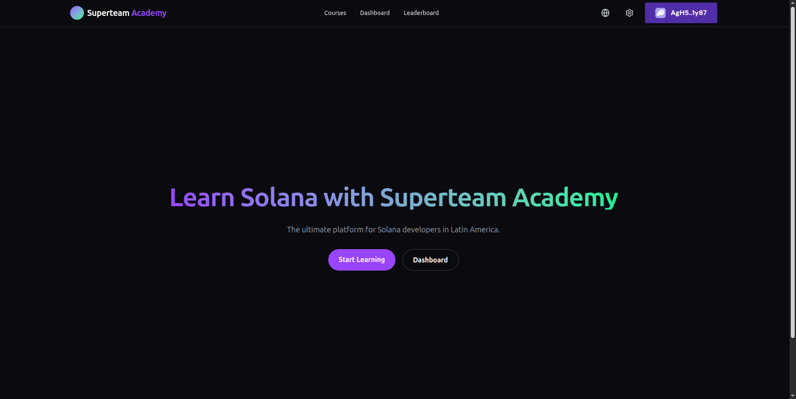 | 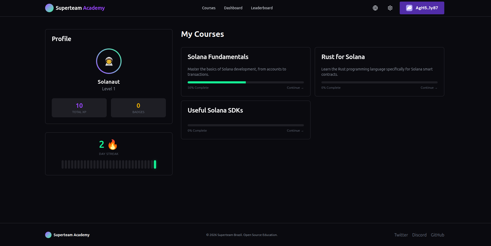 |

| Course Catalog | Single Course |
|Data | Data |
| 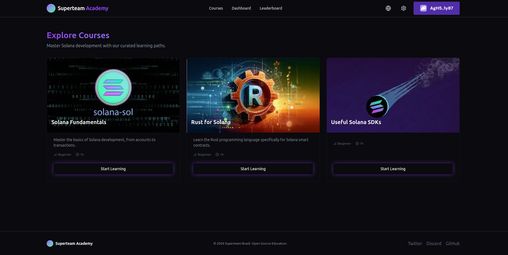 | 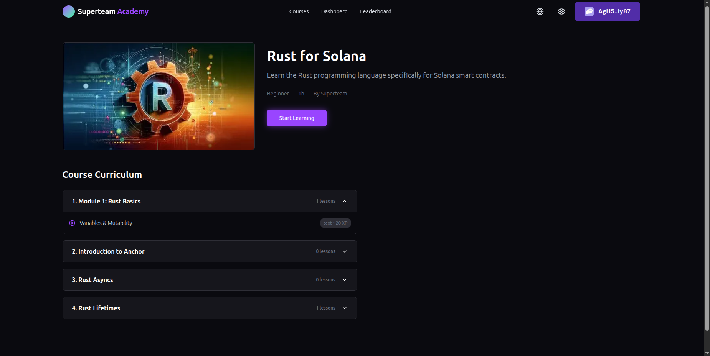 |

| Interactive Lesson | AI Helper |
|Data | Data |
| 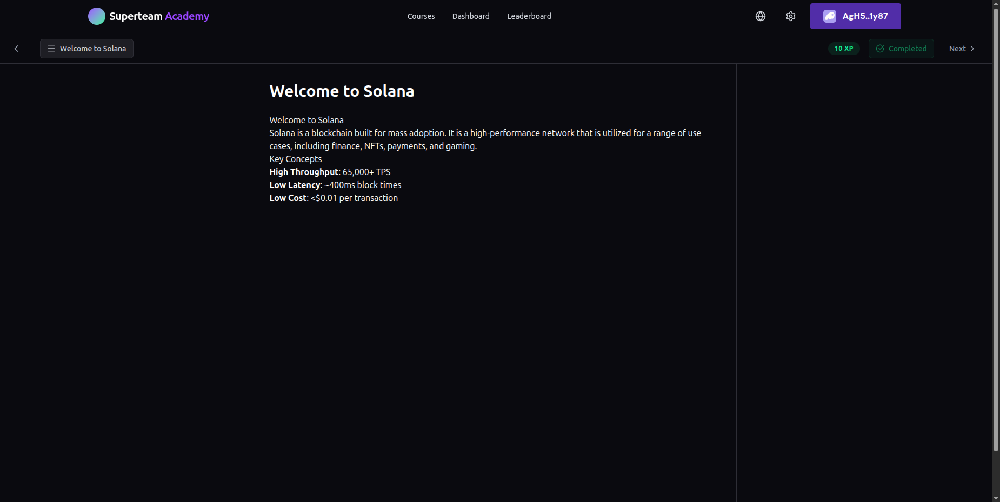 | 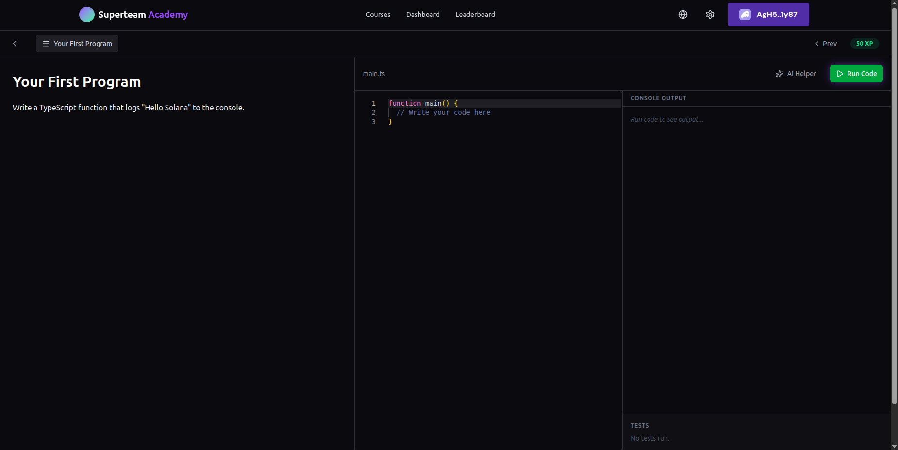 |

| Video Lesson | Leaderboard |
|Data | Data |
| 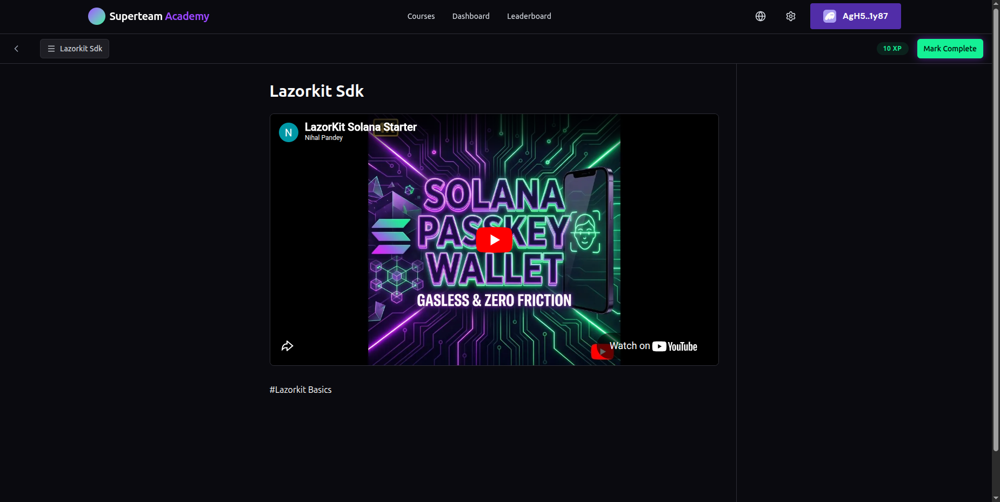 | 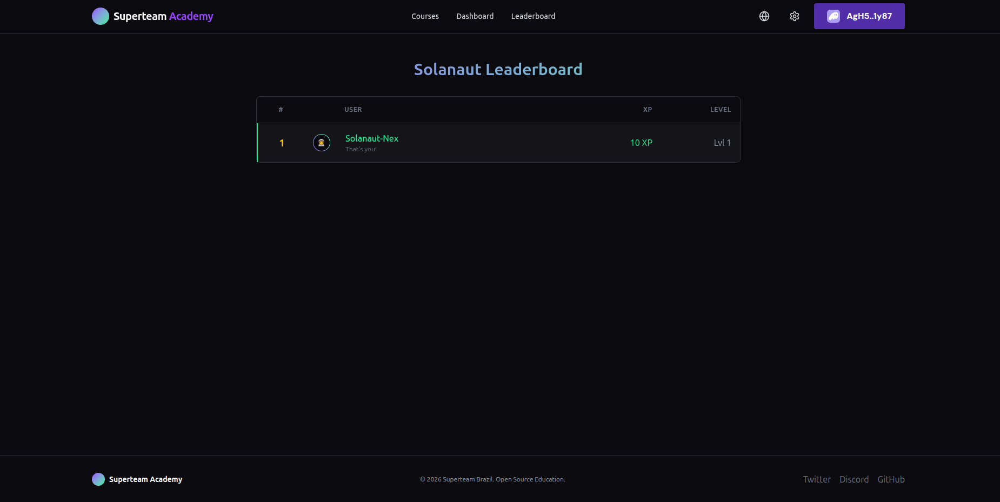 |

### Admin Dashboard

| Overview | Course Management |
|Data | Data |
| 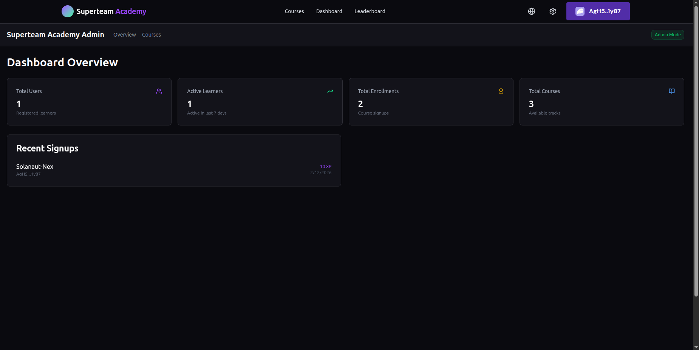 | 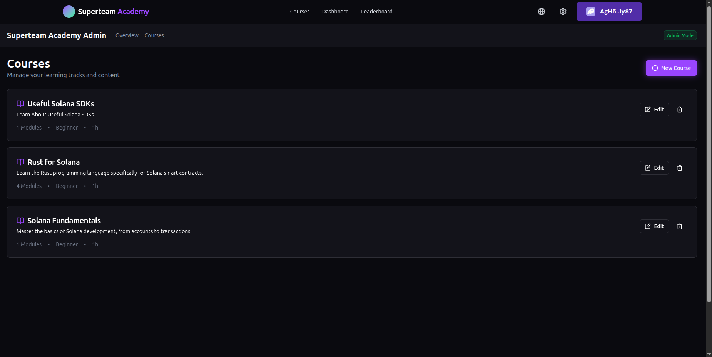 |

| Curriculum Editor |
|Data |
| 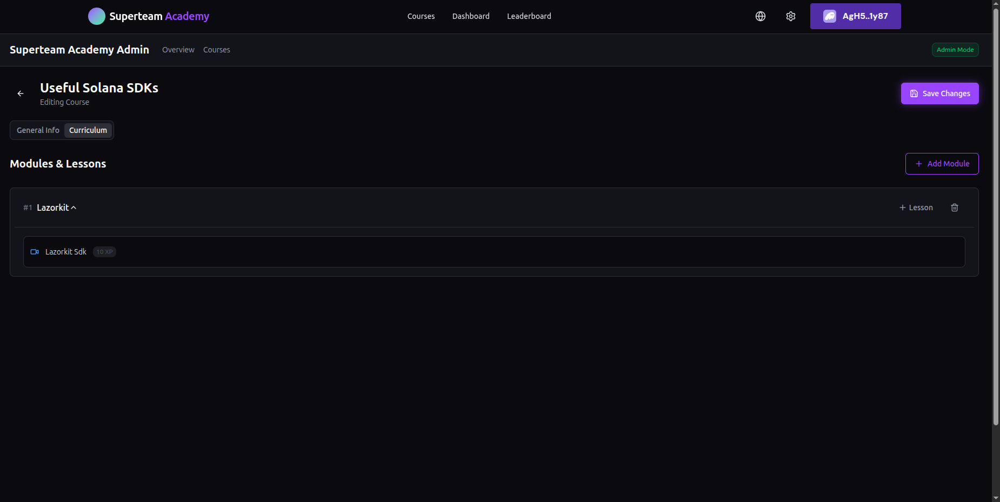 |

## ⚡ Performance

| Page    | Performance | Accessibility | Best Practices | SEO |
| ------- | ----------- | ------------- | -------------- | --- |
| Landing | 93          | 96            | 96             | 100 |
| Courses | 87          | 88            | 92             | 100 |
| Lesson  | 81          | 86            | 92             | 100 |

## 🛠 Tech Stack

- **Framework**: Next.js 15 (App Router)
- **Language**: TypeScript
- **Styling**: Tailwind CSS v4, Shadcn/UI, Framer Motion
- **Editor**: Monaco Editor
- **Web3**: Solana Wallet Adapter, Helius DAS API
- **AI**: Groq (Llama 3.3) via API Routes
- **Content**: Sanity CMS (Mocked for dev)
- **Analytics**: GA4, PostHog, Sentry

### Design Decision: TypeScript vs Rust Editor

You might notice the code editor uses **TypeScript** instead of Rust for Solana lessons.

1.  **Browser Capabilities**: Running a full Rust toolchain (cargo, rustc) in-browser requires heavy WebAssembly binaries (GBs of data) or a remote server, which adds significant latency and cost.
2.  **Educational Focus**: 50% of Solana development is client-side interaction (Wallets, RPCs, Accounts). We focus on mastering `@solana/web3.js` first, which runs natively and instantly in the browser.
3.  **Future Support**: A Rust WASM runner is planned for V2 (see [Future Improvements](docs/FUTURE_IMPROVEMENTS.md)).

## 📸 More Screenshots

### Web3 Rewards (Devnet)

| Course Completion | Minted Credential (cNFT) |
|Data | Data |
| 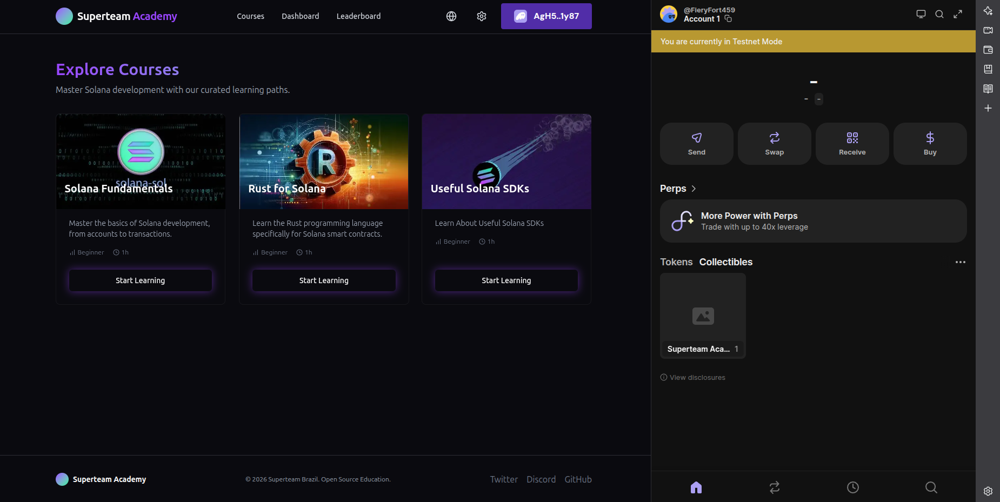 | 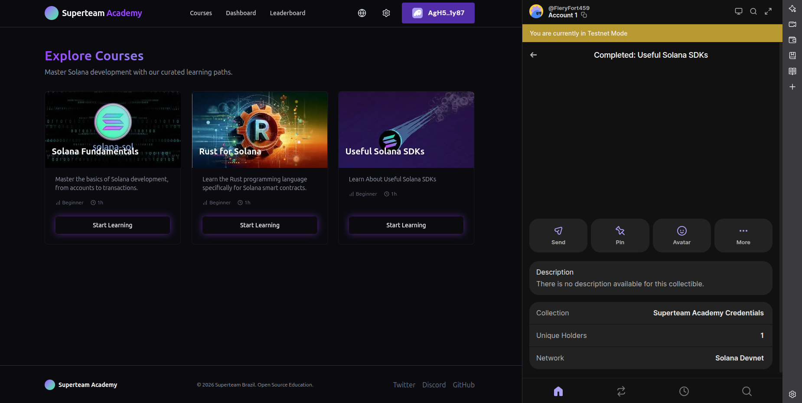 |

## 🏁 Getting Started

1. **Clone the repository**

   ```bash
   git clone https://github.com/superteam-brazil/academy-frontend.git
   cd academy-frontend/app
   ```

2. **Install Dependencies**

   ```bash
   npm install --legacy-peer-deps
   ```

3. **Environment Setup**
   Copy `.env.example` to `.env.local` and add your keys:

   ```env
   NEXT_PUBLIC_HELIUS_RPC=https://devnet.helius-rpc.com/?api-key=your-key
   GROQ_API_KEY=gsk_...
   ```

   > **Note**: This project works on **Solana Devnet**. Ensure your RPC supports it.

4. **Run Development Server**

   ```bash
   npm run dev
   ```

   Open [http://localhost:3000](http://localhost:3000) to start learning!

## 📂 Project Structure

- `src/app`: Routes (Internationalized with `[locale]`)
- `src/components`: React Components (UI, Gamification, Editor)
- `src/lib`: Logic for Content, Execution, and Web3
- `messages`: i18n Translation files

## 📚 Documentation

- [**System Architecture**](docs/ARCHITECTURE.md): Detailed system design, data flows, and account structure.
- [**Future Improvements**](docs/FUTURE_IMPROVEMENTS.md): Planned V2/V3 features and backlog.
- [**Contributing Guide**](CONTRIBUTING.md): How to add courses and translations.
- [**AI Manual**](CLAUDE.md): Context for AI agents.

## 🧪 How to Test Web3 Features

Since this project runs on **Solana Devnet**, you can test all features for free.

### 1. Connect Wallet

- Click "Connect Wallet" in the top right.
- Ensure your wallet (Phantom/Solflare) is set to **Devnet**.
- You will see your **XP Balance** (Soulbound Token) in the navbar.

### 2. Earn XP & Credentials

1. Go to **Courses** and select a course (e.g., "Solana 101").
2. Complete all lessons (Video or Text).
3. On the final lesson, click **"Complete & Mint"**.
4. **Approve the Transaction**: This will:
   - Mint a **cNFT Credential** to your wallet (via Helius).
   - Airdrop **XP Tokens** to your wallet.
5. Check your **Profile** or **Leaderboard** to see your updated stats!

## 🤝 Contributing

See [CONTRIBUTING.md](CONTRIBUTING.md) for details on how to add new courses or translations.

## 🤖 AI-Assisted Development

This project includes a `CLAUDE.md` file which serves as a context manual for AI coding assistants (like Cursor, GitHub Copilot, or Claude). It contains:

- **Project Context**: Architecture, Tech Stack, and Design Patterns.
- **Rules**: Coding standards and strict "no-slop" guidelines.
- **Commands**: Shortcuts for common development tasks.

If you are using an AI tool to maintain this repo, point it to `CLAUDE.md` first!

## 📄 License

MIT © Superteam Brazil
